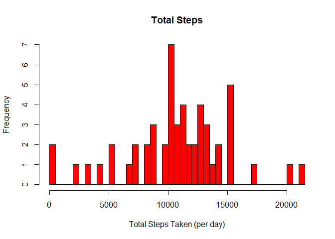

  
---------------------------------------------------------------------------------------------- 
This is an R Markdown document that contains the analysis required for the first peer graded assignment in Reproducible Research (the 5th course in the Coursera Data Science series).
-----------------------------------------------------------------------------------------------
-----------------------------------------------------------------------------------------------
  
    
    
Load the required packages

```r
library(ggplot2)
library(timeDate)
```


Read the data  
*(1. Code for reading in the dataset and/or processing the data)*

```r
activity <- read.csv('activity.csv')
```


#ANALYSIS OF TOTAL STEPS TAKEN IN ANY GIVEN DAY  
  
The following analysis evalutes the distribution of the number of steps taken over the course of a day

Sum Steps By Day

```r
daydata <- aggregate(activity$steps, by=list(date=activity$date), FUN=sum)
colnames(daydata)[2] <- "steps"
```

  
Create Histogram of total number of steps in a day  
*(2. Histogram of the total number of steps taken each day)*

```r
hist(daydata$steps, 
     breaks=61,
     main = 'Total Steps', 
     xlab = 'Total Steps Taken (per day)',
     col = "red"  )
```

<!-- -->


*(3. Mean and median number of steps taken each day)*

```r
mean_s <- round(mean(daydata$steps, na.rm=TRUE), 0)
med_s  <- median(daydata$steps, na.rm=TRUE)
```

The mean number of steps taken on any given day was 1.0766\times 10^{4}  
The median number of steps taken on any given day was 10765
  
  
  
#ANALYSIS STEPS TAKEN IN EACH INTERVAL

The following analysis evalutes the number of steps taken in eacy five minute interval, averaged across days
  
Mean Steps In Each 5 Minute Interval

```r
intdata <- aggregate(activity$steps, by=list(interval=activity$interval), FUN=mean, na.rm=TRUE)
colnames(intdata)[2] <- "mean_steps"
```

Graph the time series   
*(4. Time series plot of the average number of steps taken)*  

```r
ggplot(intdata, aes(interval, mean_steps)) + geom_line() +
  xlab("5 minute intervals") + ylab("Avg Steps Across Days")
```

<!-- -->


Find the 5 minute interval with the highest average number of steps (across days)   
*(5. The 5-minute interval that, on average, contains the maximum number of steps)*

```r
maxsteps <- round( max(intdata$mean_steps),0)
maxint <- intdata[intdata$mean_steps > maxsteps, ]
maxsteps <- round(maxint$mean_steps, 0)
```

The five minute interval which, on average has the most steps is 835  
The number typical or average number of steps taken in this interval is 206


#IDENTIFY MISSING VALUES AND IMPUT


```r
miss_int <- sum(is.na(activity$steps))
```
There are 2304 intervals in the data with missing observations (NAs)
    
      
Imputation strategy: the mean number of steps for each 5 minute interval previously calculated across days will be used to imput missing data for any interval with a missing (NA) value   
  
    
The previously calculated means by interval are merged back into the main dataset  
*(6. Code to describe and show a strategy for imputing missing data)*

```r
imputdata <- merge(activity, intdata, by="interval", all=TRUE)
imputdata <- imputdata[order(imputdata$date, imputdata$interval),]
```

  
  
NAs are repleced with average steps in that interval, calculated across days

```r
imputdata$steps <- ifelse( is.na(imputdata$steps), imputdata$mean_steps, imputdata$steps)
```
  
  
Recreate Initial Analysis of Steps Taken In A Day, this time using the imputed data     
Sum Steps By Date

```r
imp_daydata <- aggregate(imputdata$steps, by=list(date=imputdata$date), FUN=sum)
colnames(imp_daydata)[2] <- "steps"
```
    
    
Re-Create a histogram of total number of steps in a day using imputed data  
*(7. Histogram of the total number of steps taken each day after missing values are imputed)*

```r
hist(imp_daydata$steps, 
     main = 'Total Steps - Imputed', breaks=61, 
     xlab = 'Total Steps Taken (per day)',
     col = "red"  )
```

<!-- -->
    
  
Recaculate means and median of steps in a day using imputed data

```r
mean_s <- mean(imp_daydata$steps, na.rm=TRUE)
med_s  <- median(imp_daydata$steps, na.rm=TRUE)
```

The mean number of steps taken on any given day was 1.0766189\times 10^{4}  
The median number of steps taken on any given day was 1.0766189\times 10^{4}
  
  
#COMPARE STEPS TAKEN ON WEEKENDS TO WEEKDAYS

Define which days are weekend days and which are weekday days  

```r
imputdata$daytype <- isWeekday(imputdata$date)
imputdata$daytype <- ifelse( imputdata$daytype, "weekday", "weekend")
```

Calclate average number of steps in each interval across days, by type of day

```r
intdata2 <- aggregate(imputdata$steps, by=list(interval=activity$interval, daytype=imputdata$daytype),
                      FUN=mean)
colnames(intdata2)[3] <- "mean_steps"
```

Grpah The two different types of days   
*(8. Panel plot comparing the average number of steps taken per 5-minute interval across weekdays and weekends)*

```r
ggplot(intdata2, aes(interval, mean_steps)) + geom_line() + facet_grid(daytype ~ .) +
  xlab("5 minute intervals") + ylab("Avg Steps Across Days")
```

<!-- -->


